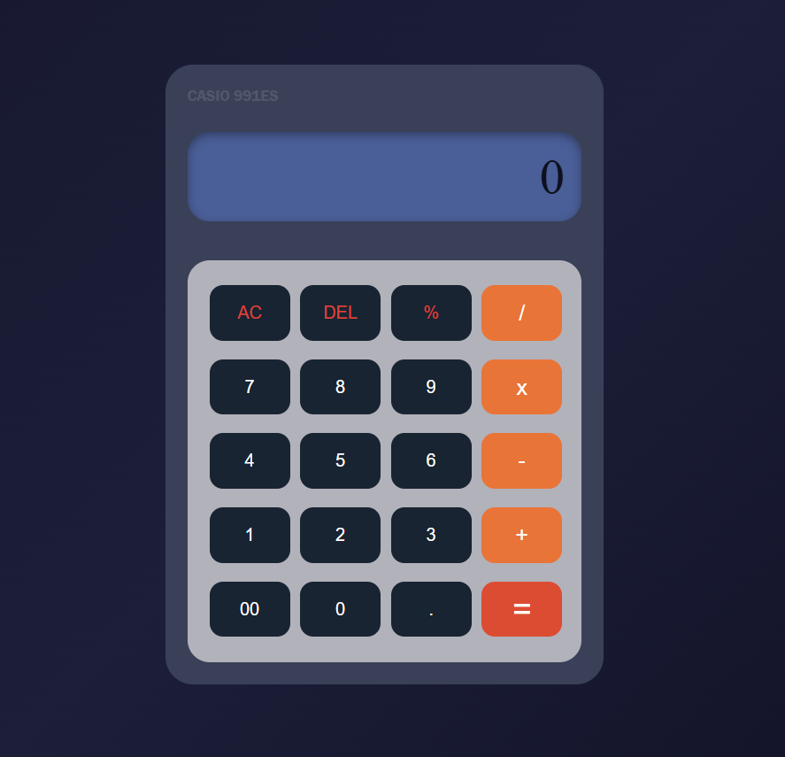

# Interactive Calculator

A fully functional and responsive calculator built using HTML, CSS, and JavaScript.  
This project performs basic arithmetic calculations with a clean and interactive user interface.

---

## Features

- Responsive calculator layout
- Basic arithmetic operations
  - Addition (+)
  - Subtraction (-)
  - Multiplication (*)
  - Division (/)
  - Percentage (%)
- AC button to clear display
- DEL button to remove last character
- Error handling for invalid expressions
- Interactive button-based input system

---

## Tech Stack

- HTML5
- CSS3
- JavaScript

---

## Project Structure

```bash
Interactive-calculator/
│
├── index.html
├── calculator.css
├── calculator.js
└── Interactive_calculator_image.png
```

---

## How to Run

1. Clone the repository

```bash
git clone https://github.com/nilabhmadhaw/Interactive-calculator.git
```

2. Open the project folder

3. Run `index.html` in your browser

---

## Screenshot



---

## Future Improvements

- Add keyboard support
- Add scientific calculator functions
- Add dark/light theme toggle
- Improve animations and UI responsiveness

---

## Author

Nilabh Madhav Mishra
